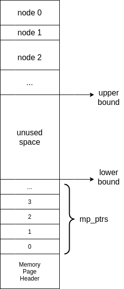

### LMDB

##### (commit: 84659a5bb6a474b50ad1b090c54e1df623d40778)

#### why mmap?

Here's a [relevant question](https://stackoverflow.com/questions/258091/when-should-i-use-mmap-for-file-access) in StackOverflow. In POSIX environment, there are at least two ways of accessing files: the regular `read()` and `write()`  functions and mmap. And mmap has great advantages in the context of multiple processes accessing a same file. 

And that's because of shared memory. With `read()` and `write()` functions, when multiple processes read a same file, the operating system has to allocate memory for each process for file reading. But with mmap, all processes share a same memory segment.

##### `mdbenv_open`

When opening a db environment, we open a database file, get the file descriptor. Then we need to create a shared memory segment attached to it if the shared memory segment doesn't exist. Otherwise, we just get the memory segment.

If a shared memory segment is newly created, we can get a pointer to the shared memory segment with `shmat` and it is assigned to a `MDB_txn` struct. With the pointer, two mutexes are mainly initialized. We will introduce you these two mutexes later.

##### `mdbenv_open2`

`mdbenv_open` is mainly about opening a database file and creating a shared memory segment, after that, we use `mdbenv_open2` to assign some database environment attributions. 

We can determine if the database is newly created by reading it's fd. If nothing to read, it's new. 

For both new and old database, we use `mmap` to map contents in file to the virtual memory space (as LMDB is featured in memory mapping). It's just for a new database, maped address is decided by OS. If with `MDB_FIXEDMAP` , this address will be recorded in the environment header so when the same database file opened again (which is relatively an old database), we can read the environment header and get the address so we can map contents in the file at the same address. `MDB_FIXEDMAP` is a highly experimental feature, it depends on how the operating system has allocated memory to shared libraries and other uses.

##### `mdb_txn_begin`

No matter if we need to put a new key/value pair into the database or delete a key/value pair from the database. These modifications to the database are all considered as transactions. Multiple modifications can be done in a single transaction or can be divided into different transactions. 

All modifications to the database won't take effect until the transaction they belonged to is formally committed. A transaction can be also read only if you set the correct flag.

Use `mdb_txn_begin` to start a new transaction. When a transaction is created, it is assigned to a unique id which is also the number of current transactions created. 

Now let's take a look at the `struct MDB_txn`:

```c
struct MDB_txn {
	pgno_t		mt_root;		/* current / new root page */
	pgno_t		mt_next_pgno;	/* next unallocated page */
	pgno_t		mt_first_pgno;
	ulong		mt_txnid;
	MDB_env		*mt_env;	
	union {
		struct dirty_queue	*dirty_queue;	/* modified pages */
		MDB_reader	*reader;
	} mt_u;
#define MDB_TXN_RDONLY		 0x01		/* read-only transaction */
#define MDB_TXN_ERROR		 0x02		/* an error has occurred */
	unsigned int		 mt_flags;
};
```

For now we can just focus on the `mt_u` member, which is a union, means it can either be `dirty_queue` or `reader`. So when it's a read only transaction, `mt_u.reader` is valid, and it's the reader function pointer. Otherwise,  a dirty queue is maintained by the transaction to keep track of dirty pages and keep data up to date.

For a read only transaction, a specific value is set by `pthread_setspecific` which is of `MDB_reader` type. I'm not gonna talk about `pthread_setspecific` and `pthread_getspecific` specifically here. All you need to know is that with these functions, a thread is able to get the value without passing parameters. When a thread begins a transaction for the first time, a `MDB_reader` type value is registered with `pthread_setspecific`, when the same thread begins a read only transaction next time, it can get the `MDB_reader` directly with `pthread_getspecific`.

For a write transaction, there's nothing much to do. Just set `env->me_txn` as the current transaction, cause the environment need to keep track of the current write transaction.

##### `mdb_put`

`mdb_put` puts a key/value pair into the database. First of all, it searches the right page in the B+ tree with `mdb_search_page`. If the tree is empty, allocate a new page.

Next, it searches the smallest node greater than the key. It may happen that the same key already exist in the tree, in that case, if the `MDB_NOOVERWRITE` flag is set, return `EEXIST` code, otherwise the original node is deleted from the page. And you can't just overwrite on the same node cause you are not sure if the data size is the same. Otherwise data belongs to other nodes may be overwritten.

If get the right node, if there is no enough space left for a new leaf node, then split the leaf node with `mdb_split`, otherwise add a new node with `mdb_add_node`.

After all above work, if the return code is not `MDB_SUCCESS`, then the transaction has an error. Any transaction with error won't be committed.

##### `mdb_txn_commit`

Constraints of committable transactions:

- Can't be read only
- Must be the current write transaction recorded in the environment struct.
- Must not have errors

Any violation causes the transaction aborted.

All write transactions carries a dirty queue, every time make changes to a page, if the page is not dirty, then the clean page is replaced with a new dirty page. After then the changes will be made to the page, so the original pages will always keep clean in a transaction. All dirty pages will be appended to the dirty queue when they are allocated. 

So when commit a transaction, all dirty pages are written back to disk. LMDB uses iovec to support multiple writing sources. Page write back address is identified by page number.

After all dirty pages have been written back, the `fsync` function is called to synchronize file contents to memory. 

Then we change database meta data and write it back to disk, for all modifications, root page number change is the most important. We assign the new database root page as the current transaction root page. So the whole tree is updated. 

After meta data has been written back to disk, we call `fsync` again to update meta data content. 

##### `mdb_search_page`

`mdb_search_page`  searches a page by a key, but `mdb_search_page` is just a wrapper of `mdb_search_page_root`.

But there's also an important thing it does:

```c
if (txn == NULL) {
	if ((rc = mdbenv_read_meta(db->md_env)) != MDB_SUCCESS)
		return rc;
	root = db->md_env->me_meta.mm_root;
} else if (F_ISSET(txn->mt_flags, MDB_TXN_ERROR)) {
	DPRINTF("transaction has failed, must abort");
	return EINVAL;
} else
	root = txn->mt_root;
```

Above is the code of choosing which root page to start with. When we need to search page, we may want to get a key without opening a transaction, or we want to put a node inside a page in a transaction. 

If the transaction parameter is NULL, means we just want to read the database, searching the last committed root page is fine, no matter if there's a write transaction or not.

If the transaction parameter is not NULL, means we want to search the new modified but not committed tree. 

##### `mdb_search_page_root`

From the root node, `mdb_search_page_root` finds all the right branch node till get to the right leaf node.

If modify parameter is 1, all branch nodes and the leaf node along the way will be replaced with new ones with page flag set `P_DIRTY`. 

##### `mdb_add_node`

Add a key/value pair into a node. If the the `F_BIGDATA` flag is set, or the data size is larger than `page_size / MDB_MINKEYS`, then the data is considered as a big data. All big data is stored in a single page. 

Let's see what's the structure of a memory page:

```c
typedef struct MDB_page {		/* represents a page of storage */
	pgno_t		mp_pgno;		/* page number */
#define	P_BRANCH	 0x01		/* branch page */
#define	P_LEAF		 0x02		/* leaf page */
#define	P_OVERFLOW	 0x04		/* overflow page */
#define	P_META		 0x08		/* meta page */
#define	P_HEAD		 0x10		/* header page */
#define	P_DIRTY		 0x20		/* dirty page */
	uint32_t	mp_flags;
#define mp_lower	mp_pb.pb.pb_lower
#define mp_upper	mp_pb.pb.pb_upper
#define mp_pages	mp_pb.pb_pages
	union page_bounds {
		struct {
			indx_t		pb_lower;		/* lower bound of free space */
			indx_t		pb_upper;		/* upper bound of free space */
		} pb;
		uint32_t	pb_pages;	/* number of overflow pages */
	} mp_pb;
	indx_t		mp_ptrs[1];		/* dynamic size */
} MDB_page;
```



A page is considered as a continuous logical memory space with a lower address and a upper address. An pointer array is stored in the page that increases from bottom to top, and that is `mp_ptrs` in `MDB_page`. `mp_ptrs` stores all pointers to key/value pairs stored in the same page, so users can quickly get a key/value pair by index. And the pointers stored in this array are sorted by key. So every time a new key/value pair inserted into the page, all pointers respond to the keys that are greater than the key inserted into have to be readjusted. 

Oppositely, all key/value pairs are stored from top to bottom, between `mp_ptrs` and key/value pairs are the free space, maintained by two variables: `pb_lower` and `pb_upper`. If the page passed in is a branch, then the `data` parameter is actually the child page number. Else if the page is a leaf, the `data` is the real data. 

#### Cursor

LMDB uses cursor to search and scan. 

```c
struct MDB_cursor {
	MDB_db		*mc_db;
	MDB_txn		*mc_txn;
	struct page_stack	 mc_stack;		/* stack of parent pages */
	short		mc_initialized;	/* 1 if initialized */
	short		mc_eof;		/* 1 if end is reached */
};
```

`mc_stack` is stack of type `struct MDB_ppage` to record all page pointers and additional information of pages along the way when a cursor walks through the tree until reaches a leaf. 

```c
typedef struct MDB_ppage {					/* ordered list of pages */
	SLIST_ENTRY(MDB_ppage)	 mp_entry;
	MDB_page		*mp_page;
	unsigned int	mp_ki;		/* cursor index on page */
} MDB_ppage;
SLIST_HEAD(page_stack, MDB_ppage);
```

When a cursor is at a leaf page, the top of `mc_stack` is the leaf page, the next if the leaf page's parent, and the next of next is the leaf page's parent's parent, and so on. 

The stack is the key to how a cursor achieves **depth-first-search**. For instance, when a cursor is at leaf page, it wants to get it's sibling page, so it pops the top of it's stack, and gets it's parent page. Increases `mp_ki`, and it can get it's sibling's page number. What if the current page is already the rightmost page of it's parent? Then the parent page will be popped from the stack, and so on.

In order to improve efficiency, `mdb_cursor_get` provides three types of options for searching.

- MDB_CURSOR or MDB_CURSOR_EXACT:

  Search a key/value pair by the key with `mdb_cursor_set`, the key must not be NULL. The cursor stops at the smallest key greater than or equal to the key provided.

  If MDB_CURSOR_EXACT, a `exact`  parameter is set to see if there is an identical key exist in the database.

- MDB_FIRST

  The key value doesn't matter(but can't be NULL), put the cursor at first slot of the leftmost leaf page. Read the slot key/value pair data into the key and value parameter provided. 

- MDB_NEXT

  Unlike the above two options, the cursor doesn't clean it's stack before doing something. If the cursor is initialized, it keeps where the cursor is, and just increases the index by 1 and read key/value pair into the parameter. Of course, if the index overflows, the cursor moves to the next sibling. So the cursor doesn't have to search from root every time. **This is a prefect option for database scanning.**

#### B+ Tree

LMDB is a B+tree-based database, even though it's official website said it's based on Btree. 

##### `mdb_split`

`mdb_split` split a page and insert \<key, (data | page number)\> in either left or right sibling. 

When split a page, first create a right sibling, temporarily set the right sibling's parent as the page's parent, and sibling's index as the page's + 1.

Then create a `copy` page which is a copy of the old page, and totally clean the old page (page header remains). Decide the `split_index` as `NUMKEYS(copy)/2+1`. 

Find a separate key and value, the separate key/value pair needs to be inserted into parent page. And the parent page may also need to call `mdb_split` if there's no enough space.

Next, we need to divide keys in the old page into two siblings. For keys with index smaller than split index, divide them into the old page, others divided into the new page. Also the new key/value pair is inserted into the new page.

After all division is done, free the `copy` page. Page split is done.

##### `mdb_rebalance`

After deleting a node from a page, the tree may need to be rebalanced. When rebalancing a tree, a page and it's parent must be specified. If more than 1/4 of page space is used, the page doesn't need to rebalance, we call the 1/4 memory page usage as the page fill threshold.

If the current page is the leftmost child of it's parent, then find a right sibling; otherwise find a left sibling. 

If the sibling page is above fill threshold and at least two keys exist in the sibling page, then move one key from it to the current page. If it's a right sibling, then move it's leftmost node; if it's a left sibling, then move it's rightmost node. Otherwise, try to merge the current page with it's sibling page. If it's a right sibling, move all sibling's nodes into the current page, otherwise move all current page's nodes into the sibling page.

##### `mdb_merge`

`mdb_merge` is only called by `mdb_rebalance`, `mdb_merge` logic is pretty simple, it just moves all nodes from src to dst and delete src node from it's parent. 

As we deleted a node from a parent page, it's almost the same thing that we did before calling `mdb_rebalance`, so the `mdb_rebalance` is called again to rebalance the parent page. That's how deletion in a B+ tree works.

You may wonder how the current page's parent gets it's parent page? Well, if you read the source code, and watch the bottom lines of `mdb_merge`:

```c
	mpp.mp_page = src->mp_parent;
	dh = (MDB_dhead *)src->mp_parent;
	dh--;
	mpp.mp_parent = dh->md_parent;
	mpp.mp_pi = dh->md_pi;
```

You may have no idea, what's the point of `dh--`. Well, all new page allocations go through `mdb_newpage` function. When `mdb_newpage` allocate a new page, it allocates size of `page_size*num + sizeof(MDB_dhead)`. That's right, every page comes with a `MDB_dhead`, it's just most of the time we don't use it. But if you get a pointer to a page, decrease it by size of `MDB_dhead`, you get the pointer to it's `MDB_dhead`.

```c
typedef struct MDB_dhead {					/* a dirty page */
	SIMPLEQ_ENTRY(MDB_dpage)	 md_next;	/* queue of dirty pages, equals to struct {struct MDB_dpage* sqe_next} */
	MDB_page	*md_parent;
	int			md_pi;				/* parent index */
	int			md_num;
} MDB_dhead;
```

In `MDB_dhead`, you can get any page's parent pointer, page index in it's parent, i.e.

#### Toggle Meta Data Page

As there may be two groups of threads/processes reading a same metadata page (one reader, one writer) or multiple readers and one writer.

For normal data pages, when a writer need to modify it, we have copy-on-write mechanism to protect readers read clean data. But when a writer needs to commit a transaction, it will modify the metadata page to update metadata, and there's a chance that a reader may reading the metadata page when a writer modifying it. And all things may be messed up.

So, to solve this problem. We use **two metadata pages** for switching, in program, this is called `metatoggle`. When reading the metadata page, no matter it's a reader or writer, we always read the page with the newest transaction id (newest transaction has the largest id). And when a writer commits a transaction, it always modifies the metadata page with the relatively older transaction id and updates the page's transaction id. So the upcoming readers/writers will read this page. And the next writer will commit to another page.

